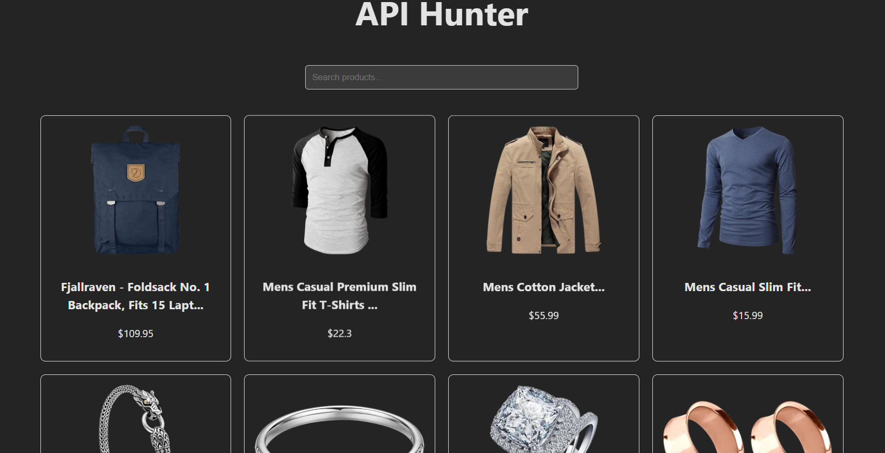

# 📡 API Hunter

A dynamic React.js application built with **Vite** that allows users to explore, search, and filter data from a public REST API. This project demonstrates modern React patterns, including hooks, asynchronous data fetching, and responsive UI design.


[Image of React component architecture diagram]


## 🎯 Project Overview
The goal of this project is to create a clean, user-friendly interface that handles real-world data. It features a responsive 4-column grid layout, a live search bar, and robust error/loading states.

## 🚀 Features
- **Live API Integration**: Fetches real-time data from the [Fake Store API](https://fakestoreapi.com/).
- **Dynamic 4-Column Grid**: Optimized layout that displays 4 products per row on desktop and scales down for mobile.
- **Instant Search**: Filter through the product list in real-time.
- **State Management**: Uses `useState` and `useEffect` for clean data flow.
- **Error Handling**: Gracefully handles API failures and "No Results Found" states.

## 🛠 Tech Stack
- **React.js** (Functional Components)
- **Vite** (Build Tool)
- **Axios** (API Requests)
- **CSS3** (Grid & Flexbox)
- **Lucide-React** (Icons)

## 📁 Project Structure
```text
api-hunter/
├── src/
│   ├── components/
│   │   ├── Search.jsx   # Search input logic
│   │   ├── Card.jsx     # Individual product display
│   │   └── Loader.jsx   # Loading animation
│   ├── App.jsx          # Main logic and data fetching
│   ├── App.css          # Grid and responsive styling
│   └── main.jsx         # Entry point
├── .env                 # API Keys (if required)
└── README.md

## 📝 Learning Objectives Met

Mastered the Fetch/Axios pattern within useEffect.

Implemented Conditional Rendering for loading and error UI.

Designed a Responsive CSS Grid for varying screen sizes.

Organized project files using a professional folder structure.

.

## 📸 Screenshots
